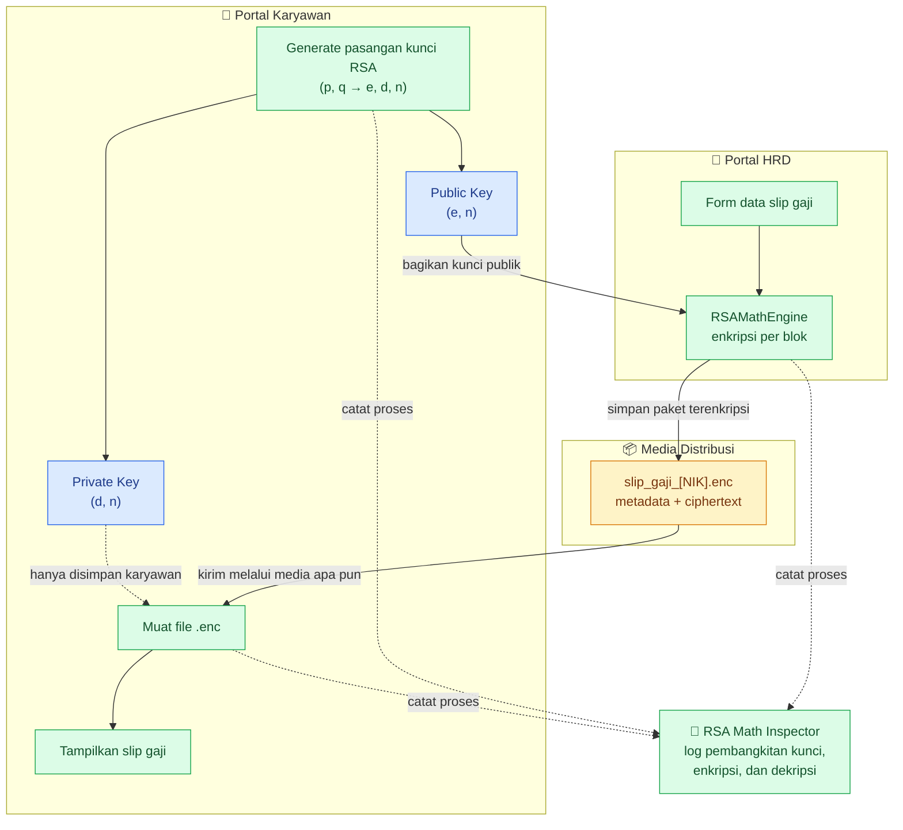
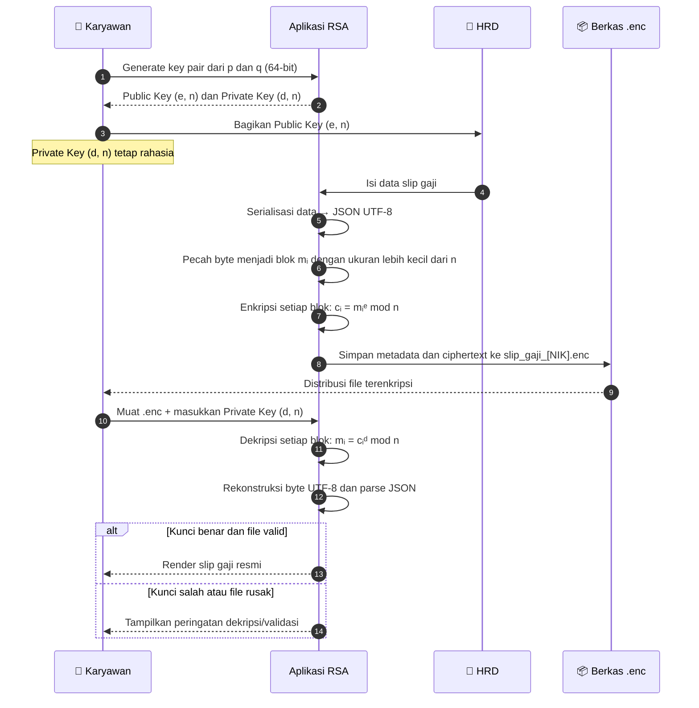

# 🛡️ Sistem Distribusi Slip Gaji yang Terenkripsi Berbasis RSA

| No | Nama Lengkap | NRP |
| :---: | :--- | :---: |
| 1 | **Naufal Ardhana** | `5027241118` |
| 2 | **Imam Mahmud Dalil Fauzan** | `5027241100` |
| 3 | **Nabilah Anindya** | `5027241006` |

---

## 📋 Daftar Isi
1. [Ringkasan Eksekutif](#-ringkasan-eksekutif)
2. [Latar Belakang & Studi Kasus](#-latar-belakang--studi-kasus)
3. [Dasar Teori & Algoritma Kriptografi](#-dasar-teori--algoritma-kriptografi)
   - [Konsep Kriptografi Asimetris](#konsep-kriptografi-asimetris)
   - [Komponen Matematis Algoritma RSA](#komponen-matematis-algoritma-rsa)
   - [Sub-Algoritma Pendukung (Implementasi Manual)](#sub-algoritma-pendukung-implementasi-manual)
4. [Arsitektur & Alur Kerja Sistem (Workflow)](#-arsitektur--alur-kerja-sistem-workflow)
5. [Detail Teknis Fungsi Enkripsi](#-detail-teknis-fungsi-enkripsi)
6. [Detail Teknis Fungsi Dekripsi](#-detail-teknis-fungsi-dekripsi)
7. [Fitur & Antarmuka Aplikasi (GUI)](#-fitur--antarmuka-aplikasi-gui)
   - [Portal Karyawan](#1-portal-karyawan)
   - [Portal HRD](#2-portal-hrd)
   - [RSA Math Inspector](#3-rsa-math-inspector)
8. [Struktur Kode Sumber](#-struktur-kode-sumber)
9. [Panduan Instalasi & Pengoperasian](#-panduan-instalasi--pengoperasian)
   - [Skenario Simulasi Lengkap](#skenario-simulasi-langkah-demi-langkah)
10. [Analisis Keamanan & Ruang Pengembangan](#-analisis-keamanan--ruang-pengembangan)
11. [Kesimpulan](#-kesimpulan)

---

## 📌 Ringkasan

Proyek ini merupakan aplikasi sistem distribusi slip gaji digital berbasis *python* yang mengimplementasikan algoritma kriptografi *Public Key* **RSA (*Rivest–Shamir–Adleman*)** yang dibangun *from scratch* tanpa menggunakan library kriptografi (seperti `pycryptodome`, `cryptography`, atau OpenSSL). Seluruh operasi teori bilangan; mulai dari pembangkitan bilangan prima acak, uji keprimaan Miller-Rabin, pencarian faktor pembagi terbesar (*GCD*), pencarian invers modulo dengan *Extended Euclidean Algorithm*, hingga eksponensiasi modular *Square-and-Multiply* diimplementasikan secara manual murni menggunakan logika Python.

Aplikasi dilengkapi dengan GUI modern berbasis **Tkinter (`ttk`)** yang membagi hak akses ke tiga portal: **Portal Karyawan**, **Portal HRD**, serta **RSA Math Inspector** (Log langkah perhitungan matematis).

---

## 🏢 Latar Belakang & Studi Kasus

Dalam operasional perusahaan modern, **Slip Gaji** adalah dokumen yang memuat data finansial yang sangat sensitif (*confidential*), seperti:
- Gaji pokok dan tunjangan khusus.
- Potongan jaminan sosial tenaga kerja / kesehatan (BPJS).
- Pemotongan Pajak Penghasilan (PPh 21).
- Total pendapatan bersih (*Take Home Pay*).

### Masalah
Jika slip gaji didistribusikan dalam *plaintext* seperti file PDF atau JSON tanpa enkripsi, data tersebut rentan terhadap ancaman intersepsi (*sniffing/man-in-the-middle attack*).

### Solusi yang Diterapkan
Menerapkan skema **Kriptografi Asimetris (Public-Key Cryptography)**:
1. **Karyawan** bertindak sebagai penerima rahasia. Karyawan perlu membuat pasangan kunci: **Kunci Publik (*Public Key*)** dan **Kunci Privat (*Private Key*)**.
2. **Public Key Karyawan** diserahkan kepada HRD untuk mengenkripsi data slip gaji. Siapa pun (termasuk HRD) dapat melihat kunci publik ini, namun public key **hanya bisa digunakan untuk mengunci/mengenkripsi**, bukan membuka data.
3. **HRD** kemudian menulis rincian gaji, lalu mengenkripsinya menggunakan *Public Key* karyawan tadi, yang menghasilkan file `.enc`.
4. Berkas `.enc` bisa dishare dengan aman melalui media apa pun.
5. **Hanya Karyawan tersebut** yang memegang *Private Key* pasangannya yang bisa mendekripsi dan menampilkan kembali slip gaji resmi secara utuh.

---

## 🧮 Dasar Teori & Algoritma Kriptografi

### Konsep Kriptografi Asimetris
Berbeda dengan algoritma simetris (seperti AES atau DES) yang menggunakan satu kunci rahasia yang sama untuk enkripsi dan dekripsi, RSA menggunakan sepasang kunci:
* **Public Key $(e, n)$**: Dipublikasikan secara bebas dan digunakan untuk proses **Enkripsi**.
* **Private Key $(d, n)$**: Dirahasiakan oleh pemiliknya dan digunakan untuk proses **Dekripsi**.

Keamanan RSA bersandar pada kesulitan matematis dalam memfaktorkan perkalian dua bilangan prima besar (*Integer Factorization Problem*).

---

### Komponen Algoritma RSA

#### 1. Pembangkitan Kunci (*Key Generation*)
1. Pilih dua bilangan prima acak yang berbeda, $p$ dan $q$.
2. Hitung modulus $n$:
   $$n = p \times q$$
   Nilai $n$ digunakan sebagai modulus untuk public key dan private key. Panjang bit $n$ menentukan kekuatan kunci (pada proyek ini dipilih $p$ dan $q$ berukuran 64-bit sehingga modulus $n$ berukuran $\approx 128$ bit).
3. Hitung fungsi *Euler’s Totient* $\phi(n)$:
   $$\phi(n) = (p - 1) \times (q - 1)$$
4. Tentukan eksponen publik $e$ sedemikian rupa sehingga:
   $$1 < e < \phi(n) \quad \text{dan} \quad \gcd(e, \phi(n)) = 1$$
   Nilai standar yang diuji pertama kali adalah $e = 65537$. Jika tidak relatif prima, dicari bilangan ganjil terkecil berikutnya.
5. Hitung eksponen privat $d$ sebagai invers perkalian modular dari $e$ terhadap modulo $\phi(n)$:
   $$e \times d \equiv 1 \pmod{\phi(n)} \iff d \equiv e^{-1} \pmod{\phi(n)}$$

#### 2. Pasangan Kunci Akhir
* **Kunci Publik (*Public Key*)**: $(e, n)$
* **Kunci Privat (*Private Key*)**: $(d, n)$
* Parameter rahasia $p$, $q$, dan $\phi(n)$ harus dibuang/dijaga kerahasiaannya setelah $d$ ditemukan.

---

### Sub-Algoritma Pendukung (Implementasi Manual)

Seluruh logika matematika diwadahi dalam kelas `RSAMathEngine` di `implementationRSA.py`:

#### A. Uji Keprimaan Probabilistik (*Miller-Rabin Primality Test*)
Fungsi: `RSAMathEngine.is_prime_miller_rabin(n, k=10)`  
Untuk menguji apakah bilangan acak berukuran 64-bit adalah bilangan prima murni:
1. Tulis $n - 1$ ke bentuk $2^s \cdot d$, di mana $d$ bernilai ganjil.
2. Pilih basis acak $a \in [2, n-2]$.
3. Hitung $x = a^d \pmod n$. Jika $x = 1$ atau $x = n - 1$, iterasi berlanjut ke saksi berikutnya.
4. Lakukan kuadrat berulang $x = x^2 \pmod n$ sebanyak $s - 1$ kali. Jika tidak menghasilkan $n - 1$, maka $n$ dipastikan komposit (bukan prima).

#### B. Algoritma Euclidean (*Greatest Common Divisor / GCD*)
Fungsi: `RSAMathEngine.gcd(a, b)`  
Menghitung Pembagi Bersama Terbesar secara iteratif menggunakan prinsip sisa pembagian:
$$r = a \pmod b, \quad a \leftarrow b, \quad b \leftarrow r$$

#### C. *Extended Euclidean Algorithm* (Invers Modulo)
Fungsi: `RSAMathEngine.extended_gcd(a, b)` dan `RSAMathEngine.mod_inverse(e, phi)`  
Mencari nilai $x$ dan $y$ dalam persamaan identitas Bézout:
$$a \cdot x + b \cdot y = \gcd(a, b)$$
Jika $\gcd(e, \phi(n)) = 1$, maka $x$ adalah invers perkalian modulo $e \pmod{\phi(n)}$, sehingga diperoleh nilai kunci privat $d$.

#### D. Eksponensiasi Modular Cepat (*Square-and-Multiply*)
Fungsi: `RSAMathEngine.mod_pow(base, exp, mod)`  
Menghitung $(base^{exp}) \pmod{mod}$ dengan kompleksitas waktu $O(\log_2(exp))$ tanpa menyebabkan *integer overflow*:
* Konversi eksponen ke bentuk biner bit-per-bit.
* Pada setiap bit: kuadratkan basis modulo $mod$.
* Jika bit bernilai 1: kalikan hasil akumulasi dengan basis modulo $mod$.

---

## 🔄 Arsitektur & Alur Kerja Sistem (Workflow)

### Arsitektur Komponen



### Alur Enkripsi hingga Dekripsi



---

## 🔒 Detail Teknis Fungsi Enkripsi

Fungsi enkripsi diimplementasikan pada `RSAMathEngine.encrypt_bytes()` dan dipanggil melalui handler `_handle_encrypt_payroll()` pada antarmuka HRD.

### 1. Serialisasi Data Plaintext
Data formulir penggajian dikemas ke dalam struktur *Dictionary* Python, kemudian dikonversi menjadi *string* JSON UTF-8:
```json
{
  "nik": "IT-2024-001",
  "nama": "Budi Pratama",
  "jabatan": "Senior Network & Security Engineer",
  "periode": "Oktober 2026",
  "rincian": {
    "gaji_pokok": 12500000.0,
    "tunjangan": 3500000.0,
    "potongan_bpjs": 450000.0,
    "potongan_pph": 650000.0,
    "take_home_pay": 14900000.0
  },
  "catatan": "Semoga berkah.",
  "timestamp": "2026-10-08T23:20:00.000000"
}
```

### 2. Mekanisme Pemecahan Blok (*Chunking / Blocking*)
Syarat mutlak matematis RSA adalah nilai integer pesan $m$ **harus lebih kecil dari modulus $n$** ($m < n$). Jika $m \ge n$, hasil modulo akan memotong nilai asli dan data tidak dapat dipulihkan.

Oleh karena itu, byte array dipecah menjadi blok-blok berukuran aman:
$$\text{block\_size} = \max\left(1, \left\lfloor \frac{\text{bit\_length}(n) - 1}{8} \right\rfloor\right)$$
*Contoh:* Untuk modulus 128-bit, $\lfloor (128 - 1) / 8 \rfloor = 15$ byte per blok. Setiap potongan 15 byte dijamin merepresentasikan bilangan bulat $m_i < 2^{120} < n$.

### 3. Transformasi Matematika Enkripsi
Untuk setiap blok $i$:
1. Potongan byte dikonversi menjadi bilangan bulat (*Big-Endian*):
   $$m_i = \text{int.from\_bytes}(\text{chunk}_i, \text{byteorder} = \text{'big'})$$
2. Hitung ciphertext $c_i$ menggunakan metode *Square-and-Multiply*:
   $$c_i = (m_i^e) \pmod n$$
3. Nilai $c_i$ disimpan dalam format string desimal.

### 4. Struktur Dokumen Terenkripsi (`.enc`)
Hasil enkripsi diekspor ke file JSON berformat `.enc` yang memuat:
```json
{
  "target_nik": "IT-2024-001",
  "algorithm": "Manual-RSA-Square-Multiply",
  "block_byte_size": 15,
  "block_lengths": [15, 15, 15, ..., 7],
  "ciphertext": [
    "284719283719283719283...",
    "192837401928301928301...",
    "..."
  ]
}
```
> **Catatan:** `block_lengths` disimpan agar blok terakhir yang ukurannya $< \text{block\_size}$ dapat dikonversi kembali ke jumlah byte yang tepat tanpa distorsi *leading zeros*.

---

## 🔓 Detail Teknis Fungsi Dekripsi

Fungsi dekripsi diimplementasikan pada `RSAMathEngine.decrypt_bytes()` dan dipanggil melalui handler `_handle_decrypt_payroll()` pada antarmuka Karyawan.

### 1. Pembacaan Berkas `.enc` dan Validasi Kunci
Pengguna memilih file `.enc`, kemudian menginputkan parameter Private Key miliknya:
- Eksponen privat: $d$
- Modulus: $n$

### 2. Transformasi Matematika Dekripsi
Untuk setiap blok ciphertext $c_i$:
1. Konversi teks ciphertext ke integer: $c_i = \text{int}(c_i)$.
2. Hitung plaintext integer $m_i$ menggunakan rumus inversi RSA:
   $$m_i = (c_i^d) \pmod n$$
3. Konversi integer $m_i$ kembali ke bentuk byte asli dengan panjang byte yang sesuai dari `block_lengths`:
   $$\text{chunk}_i = m_i.\text{to\_bytes}(\text{length}_i, \text{byteorder} = \text{'big'})$$
4. Gabungkan seluruh `chunk_i` ke dalam satu `bytearray`.

### 3. Rekonstruksi & Proteksi Integritas Data
- Seluruh byte array didecode ke string UTF-8: `decrypted_bytes.decode("utf-8")`.
- String diuraikan kembali ke objek JSON melalui `json.loads()`.
- **Integritas Otomatis:** Apabila kunci privat $d$ yang dimasukkan salah meskipun hanya 1 digit, hasil perhitungan matematika modulo akan menghasilkan urutan byte acak yang bukan merupakan teks UTF-8 atau struktur JSON yang valid. Aplikasi akan segera menangkap exception `json.JSONDecodeError` dan memberi peringatan bahwa kunci salah atau file telah dimanipulasi.

---

## 🖥️ Fitur & Antarmuka Aplikasi (GUI)

Aplikasi dibangun menggunakan **Python Tkinter (`ttk`)** dengan tema visual bergaya antarmuka modern (*Slate & Blue Theme*). Antarmuka terdiri dari 3 tab utama:

### 1. Portal Karyawan
* **Generator Pasangan Kunci RSA:** Menghasilkan pasangan $(e, n)$ dan $(d, n)$ berukuran 128-bit secara instan hanya dengan 1 tombol klik.
* **Simpan Kunci:** Fitur untuk mengekspor kunci privat dan publik ke dalam file `.json` lokal.
* **Dekripsi File `.enc`:** Memuat file slip gaji terenkripsi, mengisikan parameter $d$ dan $n$, lalu melakukan dekripsi.
* **Viewer Slip Gaji Resmi:** Menampilkan rincian kompensasi dalam format layout ASCII formal (Pendapatan Kotor, Potongan Pajak, BPJS, dan Gaji Bersih / *Take Home Pay*).

### 2. Portal HRD
* **Form Rincian Penggajian Lengkap:** Input NIK, Nama Lengkap, Jabatan/Posisi, Periode, Gaji Pokok, Tunjangan, Potongan BPJS, Potongan Pajak PPh 21, dan Catatan Tambahan.
* **Penyalin Kunci Publik Otomatis:** Tombol integrasi untuk menyalin kunci publik dari Tab Karyawan atau memasukkan kunci publik secara manual.
* **Engine Enkripsi RSA:** Melakukan pemecahan blok dan enkripsi instan.
* **Preview Ciphertext Per Blok:** Menampilkan daftar nilai ciphertext $[c_1, c_2, \dots]$.
* **Ekspor Berkas `.enc`:** Menyimpan paket payload terenkripsi ke media penyimpanan untuk didistribusikan.

### 3. RSA Math Inspector
Tab khusus untuk keperluan demonstrasi dan edukasi akademik kriptografi. Menampilkan log kronologis lengkap langkah-langkah komputasi:
* Penemuan bilangan prima acak $p$ dan $q$.
* Perhitungan modulus $n$ dan fungsi Euler $\phi(n)$.
* Pengujian FPB $\gcd(e, \phi(n)) = 1$.
* Penentuan invers modulo $d$ dan verifikasi $e \times d \equiv 1 \pmod{\phi(n)}$.
* Nilai integer pesan $m_i$, rumus, dan nilai ciphertext $c_i$ untuk sampel blok pertama.

---

## 📂 Struktur Kode Sumber

Kode sumber utama terletak pada file tunggal yang terorganisir rapi:

```
KRIPTO ENSKRIPSI DEKRIPSI/
│
├── implementationRSA.py    # Seluruh implementasi: RSA Math Engine + GUI Tkinter
└── README.md               # Laporan teknis & dokumentasi proyek lengkap
```

### Rincian Modul dalam `implementationRSA.py`:
1. **Bagian 1: `RSAMathEngine` (Baris 21–201)**
   - `gcd(a, b)`: Algoritma Euclidean pembagi bersama terbesar.
   - `extended_gcd(a, b)`: Algoritma Euclidean diperluas untuk Bézout identity.
   - `mod_inverse(e, phi)`: Perhitungan kunci privat $d$.
   - `mod_pow(base, exp, mod)`: Eksponensiasi modular metode *Square-and-Multiply*.
   - `is_prime_miller_rabin(n, k)`: Uji keprimaan probabilistik Miller-Rabin.
   - `generate_prime(bits)`: Generator bilangan prima acak ganjil berukuran bit tertentu.
   - `generate_keypair(bits)`: Pembangkitan lengkap $(p, q, n, \phi, e, d)$.
   - `encrypt_bytes(bytes, e, n)`: Pemecah blok & enkripsi byte ke blok $c_i$.
   - `decrypt_bytes(blocks, sizes, d, n)`: Dekripsi blok $c_i$ & rekonstruksi byte asli.
2. **Bagian 2: `SecurePayrollApp` (Baris 204–716)**
   - `_configure_styles()`: Konfigurasi visual UI Tkinter/ttk.
   - `_build_karyawan_tab()`: Layout tab Karyawan.
   - `_build_hrd_tab()`: Layout formulir HRD & panel enkripsi.
   - `_build_inspector_tab()`: Layout konsol log edukasi matematika.
   - Event handlers: `_handle_generate_keys`, `_handle_encrypt_payroll`, `_handle_decrypt_payroll`, `_handle_export_enc_file`, dsb.
3. **Bagian 3: Entry Point (Baris 718–722)**
   - Inisialisasi jendela utama dan `mainloop()`.

---

## 🚀 Requirements & Cara Run

* **Python Runtime:** Python 3.8 atau yang lebih baru.

1. Buka terminal
2. Arahkan direktori ke folder proyek:
   ```bash
   cd "Kriptografi-Implementasi-RSA"
   ```
3. Run dengan Python:
   ```bash
   python implementationRSA.py
   ```

---

### Panduan Menggunakan Aplikasi

#### Tahap 1: Pembangkitan Kunci oleh Karyawan
1. Buka tab **👤 Portal Karyawan**.
2. Klik tombol **🔑 Generate New Key Pair (64-bit)**.
3. Pasangan kunci akan muncul di layar:
   - Public Key Karyawan $(e, n)$.
   - Private Key Karyawan $(d, n)$.
4. *(Opsional)* Simpan kunci ke file cadangan melalui tombol **💾 Simpan Kunci**.

#### Tahap 2: Input & Enkripsi Data oleh HRD
1. Pindah ke tab **🏢 Portal HRD**.
2. Klik tombol **📥 Salin Otomatis dari Tab Karyawan** untuk langsung mendapatkan Public Key Karyawan (atau ketikkan $e$ dan $n$ manual).
3. Isi Semua Detail Data Gaji Karyawan.
4. Klik tombol **🔒 Enkripsi Data Slip Gaji Sekarang**.
5. Nilai ciphertext per blok akan langsung muncul.
6. Klik tombol **📤 Simpan File .enc** dibawah.

#### Tahap 3: Dekripsi & Pemeriksaan Slip oleh Karyawan
1. Kembali ke tab **👤 Portal Karyawan**.
2. Pada bagian *2. Dekripsi File Slip Gaji (.enc)*, klik **📂 Load File .enc** lalu pilih file **`.enc`** yang tadi disimpan.
3. Klik tombol hijau **🔓 Dekripsi & Tampilkan Slip Gaji**.
4. Pada panel sisi kanan, **Slip Gaji Resmi** akan ditampilkan dengan seluruh rincian nominal yang akurat dan rapi.

#### Tahap 4: Pembuktian Matematis di Inspector
1. Buka tab **🔬 RSA Math Inspector**.
2. Telusuri seluruh riwayat perhitungan matematika yang telah berjalan dari langkah pertama hingga selesai.

---

## 🛡️ Analisis Keamanan & Pengembangan

| Aspek | Kondisi Saat Ini (Implementasi Proyek) | Standar Industri / Rekomendasi |
|---|---|---|
| **Panjang Kunci Modulus** | $\approx 128$ bit ($p, q$ masing-masing 64-bit) untuk demo saja. | 2048-bit atau 4096-bit untuk proteksi komersial jangka panjang. |
| **Metode Padding** | Skema pembagian blok langsung (*Direct Byte Chunking* $m_i < n$). | Menggunakan skema padding standar seperti **OAEP (*Optimal Asymmetric Encryption Padding*)** untuk mencegah serangan *Chosen Ciphertext Attack (CCA)*. |
| **Kriptografi Hibrida** | Full RSA untuk seluruh data JSON. | Menggunakan skema *Hybrid Cryptography* (Enkripsi simetris AES-GCM untuk payload, dan kunci AES dienkripsi menggunakan RSA) jika ukuran data dokumen sangat besar. |
| **Tanda Tangan Digital** | Verifikasi integritas melalui struktur JSON parsial. | Menambahkan fitur *Digital Signature* (HRD menandatangani file menggunakan Private Key HRD, karyawan memverifikasi dengan Public Key HRD). |

---

## Pertanyaan yang Sering Diajukan (FAQ)
### 1. RSA kan algoritma yang hanya menghitung angka, kenapa karakter Huruf dan Simbol Ikut Terenkripsi?

> Penjelasan:
Huruf sebenarnya tidak pernah ada. Semua teks di layar adalah representasi deretan biner (bytes) berbasis tabel ASCII/UTF-8.
Misal kata "GAJI" terdiri dari 4 biner byte: [71, 65, 74, 73]. Keempat byte ini diperlakukan sebagai satu bilangan bulat besar (Big Integer) dengan notasi basis 256:
$$m = (71 \times 256^3) + (65 \times 256^2) + (74 \times 256^1) + (73 \times 256^0) = 1.195.461.193$$
Nilai integer $1.195.461.193$ lah yang menjadi nilai $m$ pada rumus matematika RSA $c = m^e \pmod n$. Jadi, program kami tetap murni menghitung angka.

**Kesimpulan: Jika ID dan Nama dibiarkan plaintext, attacker di jaringan bisa menukar potongan ciphertext gaji Direktur dengan gaji milik karyawan tanpa memecahkan kuncinya.**

Selain itu, Catatan HRD (misalnya alasan pemotongan disiplin atau bonus rahasia) merupakan data privasi karyawan.
Dengan membungkus seluruh slip gaji dalam satu JSON lalu mengenkripsinya secara utuh (envelope encryption), dokumen tersebut menjadi satu kesatuan yang tidak bisa dimanipulasi per bagian.


### Q2. Form Gaji Hanya 9 Isian, Tapi kok Ciphertext-nya Muncul 20+ Blok?

**A2. Aturan Matematis Batas Ukuran Blok ($m_i < n$):**
- Ukuran Modulus $n$ Kita 128-bit : dari dua bilangan 64-bit ($p$ dan $q$).
$n = p \times q \approx 128\text{ bit}$.
- Kapasitas Maks 1 Blok : Satu byte adalah 8 bit, Maka kapasitas maksimal data yang dijamin bernilai $m_i < n$ adalah:
$$\text{Ukuran Blok} = \left\lfloor \frac{128 - 1}{8} \right\rfloor = 15\text{ byte (atau 15 karakter)}$$
- Panjang JSON yang Dihasilkan dari 9 data form HRD disusun kedalam format JSON memiliki sekitar 330 karakter (330 byte):
```json
{
    "nik":"IT-2024-001",
    "nama":"Fauzan",
    "jabatan":"Senior Network & Security Engineer",
    "periode":"Oktober 2026",
    "rincian":{
        "gaji_pokok":12500000.0,
        "tunjangan":3500000.0,
        "potongan_bpjs":450000.0,
        "potongan_pph":650000.0,
        "take_home_pay":14900000.0
    },
    "catatan":"Semoga berkah.",
    "timestamp":"2026-10-08T14:30:00"
}
```

- Perhitungan Jumlah Blok:
$$
    \text{Jumlah Blok} = \left\lceil \frac{330\text{ byte}}{15\text{ byte per blok}} \right\rceil \approx 22\text{ blok}
$$
Setiap 15 karakter dipotong menjadi satu bilangan bulat $m_i$, lalu masing-masing dipangkatkan dengan $e$ modulo $n$ menghasilkan satu nilai $c_i$. Itulah alasan mengapa muncul 22 baris angka ciphertext. 


---

## 🎯 Kesimpulan

1. Proyek ini berhasil membuktikan bahwa algoritma kriptografi kunci publik **RSA dapat diimplementasikan secara murni dari nol (*from scratch*)** menggunakan bahasa pemrograman Python standar tanpa bantuan pustaka kriptografi eksternal.
2. Seluruh konsep teori bilangan mendasar—seperti pengujian keprimaan probabilistik Miller-Rabin, pencarian invers modulo dengan Algoritma Euclidean Diperluas, dan eksponensiasi modular cepat *Square-and-Multiply*—berfungsi dengan presisi tinggi dan terbukti mampu mengenkripsi dan mendekripsi data terstruktur (JSON UTF-8) tanpa kehilangan satu byte pun.
3. Implementasi studi kasus **Slip Gaji Karyawan** memperlihatkan penerapan nyata prinsip kerahasiaan (*confidentiality*) dan hak akses (*access control*): hanya pemilik Private Key sah yang berhak membuka rincian kompensasi finansial yang telah dikunci oleh Public Key miliknya.
4. Antarmuka GUI berbasis Tkinter dengan tiga portal mempermudah pemahaman alur operasional sekaligus memberikan nilai edukatif tinggi melalui fitur *RSA Math Inspector*.
